# Visualization results of after-course survey

This document lists the visualization results of the after-course survey. The pictures are in [pictures](./pictures) dir.

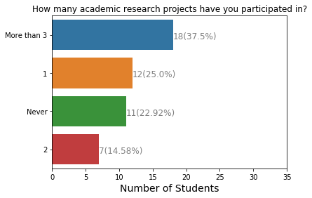

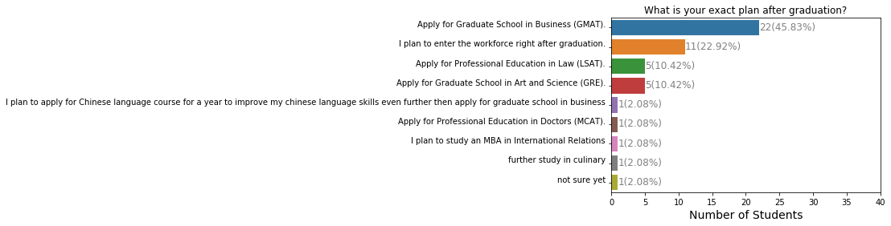

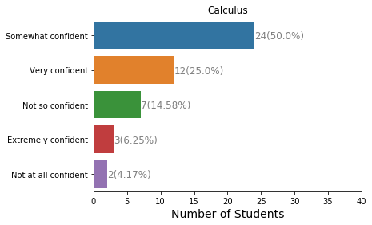

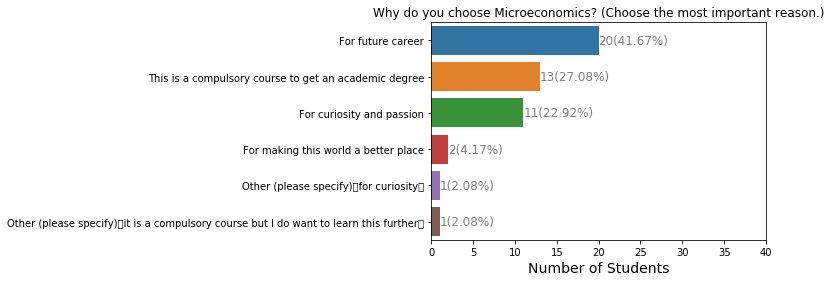

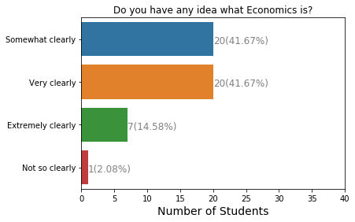

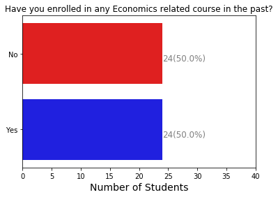

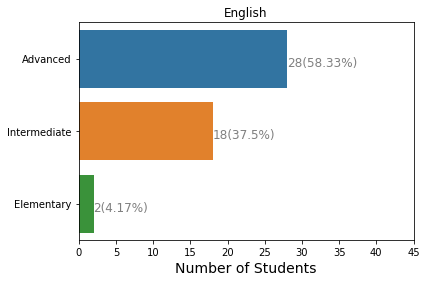

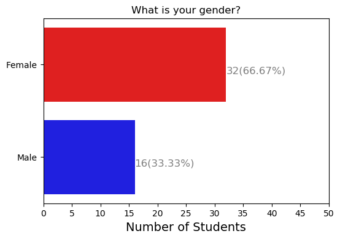

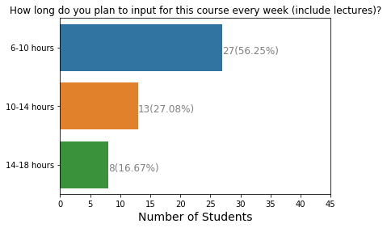

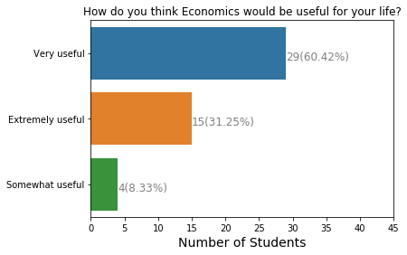

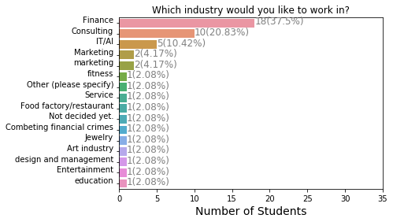

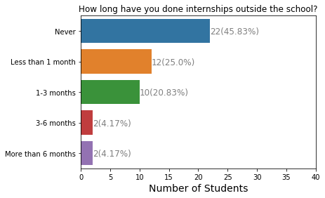

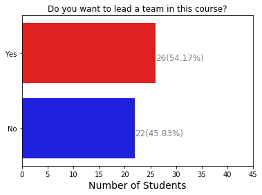

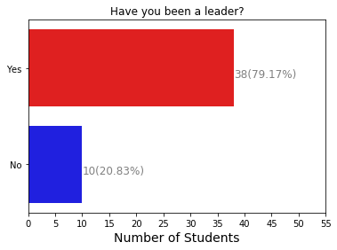

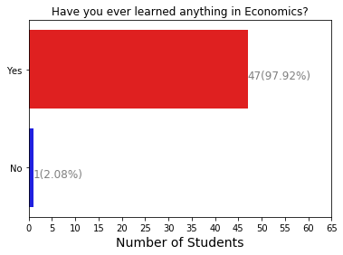

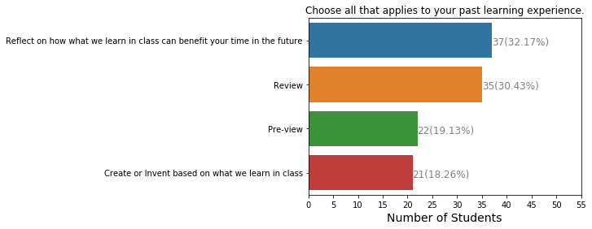

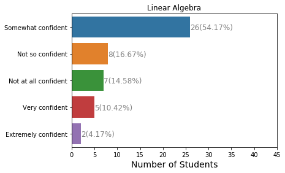

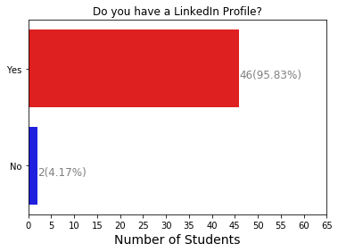

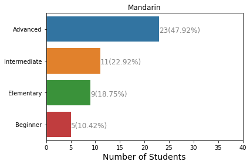

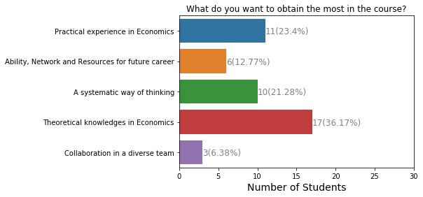

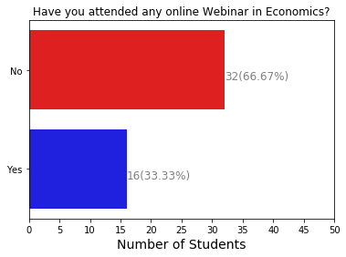

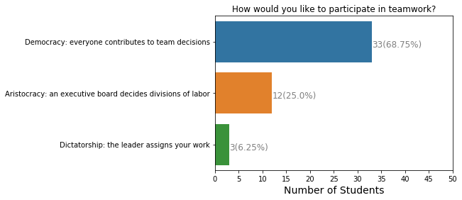

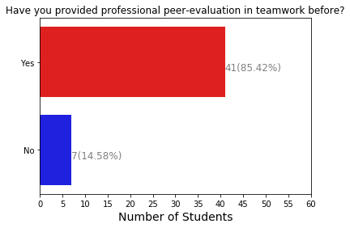

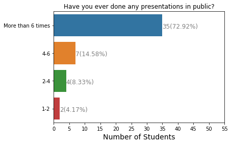

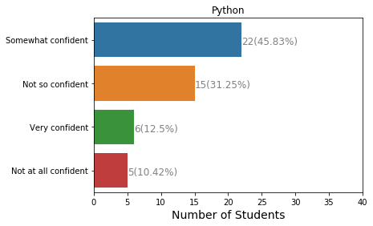

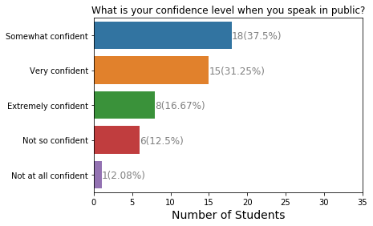

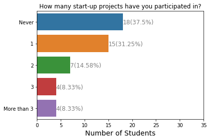

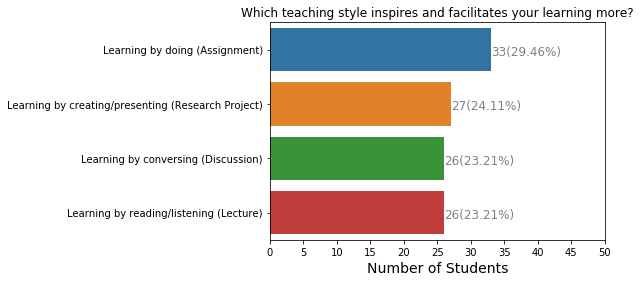

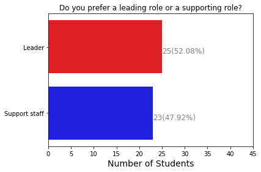

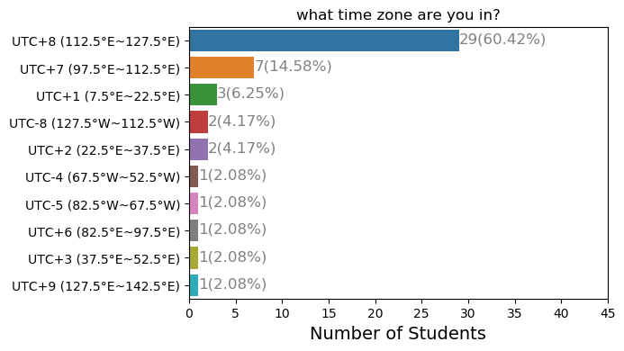

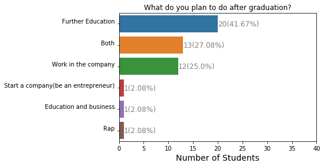

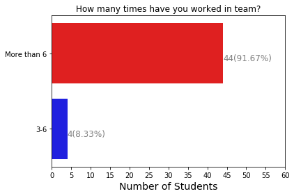

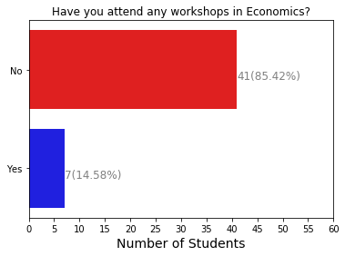