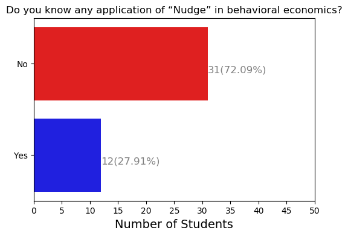

# Visualization results of pre-course survey

This document lists the visualization results of the pre-course survey of the Behavioral Finance mini-course. The pictures are in [pictures](./pictures) dir.

