# Visualization results of pre-course survey

This document lists the visualization results of the pre-course survey. The pictures are in [pictures](./pictures) dir.

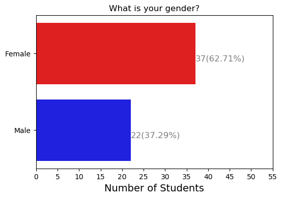

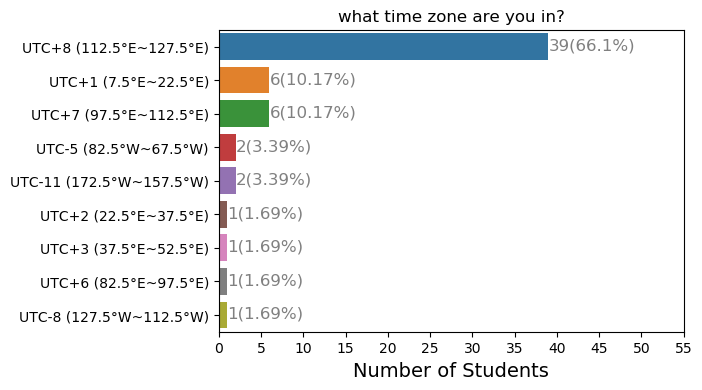

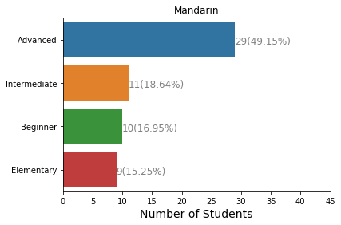

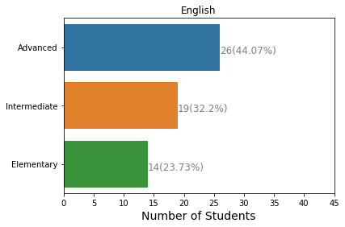

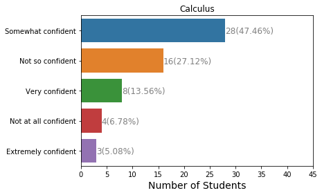

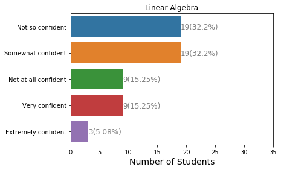

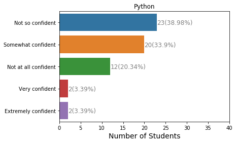

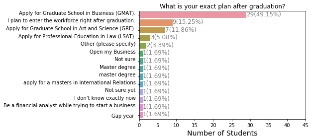

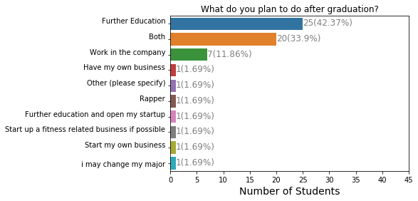

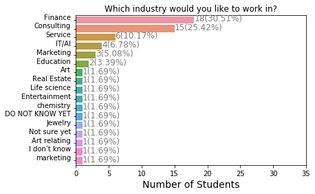

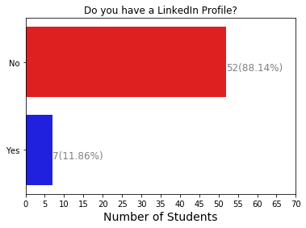

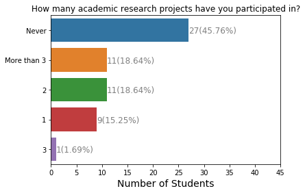

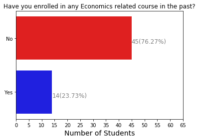

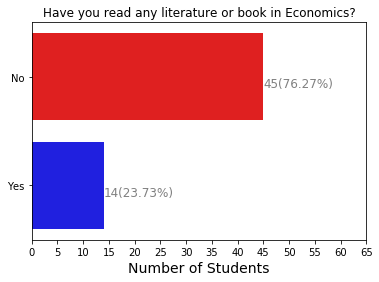

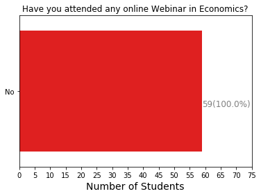

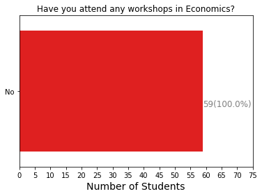

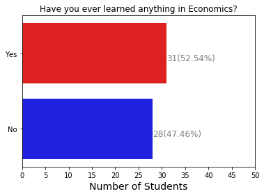

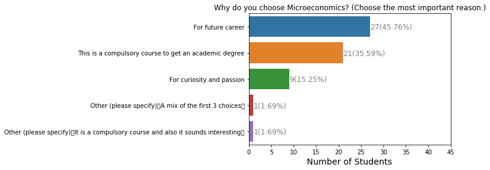

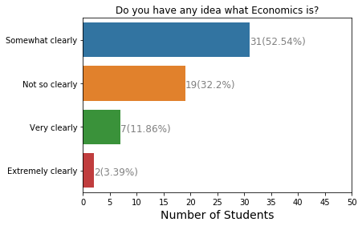

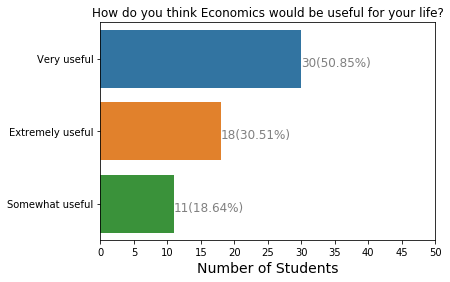

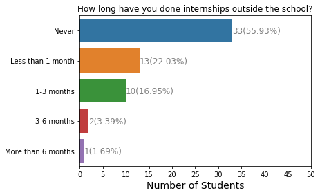

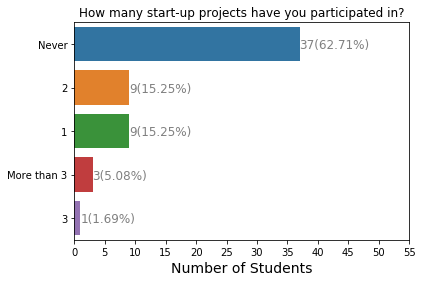

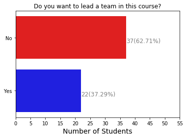

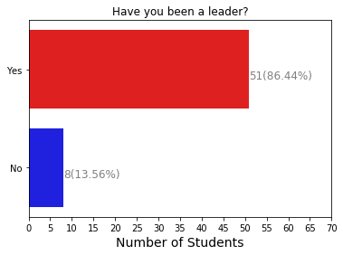

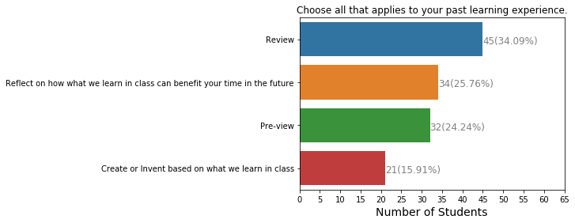

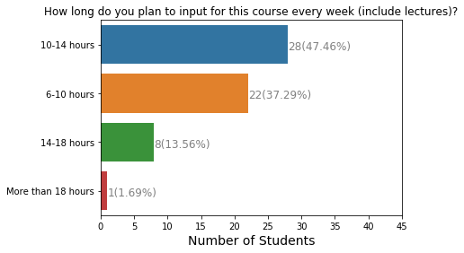

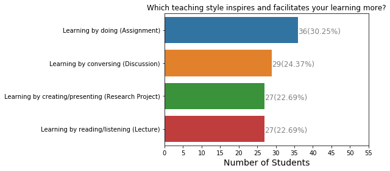

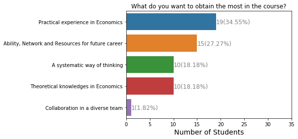

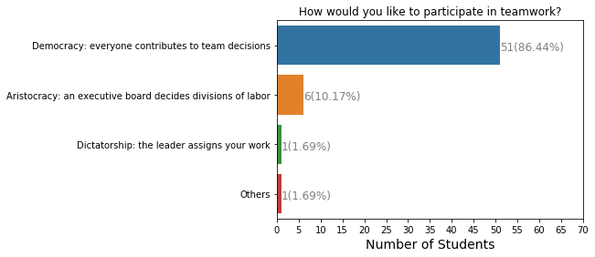

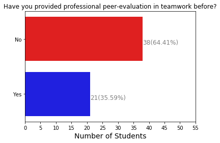

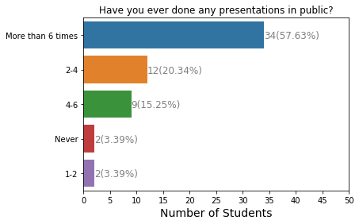

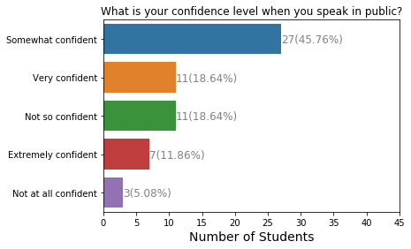

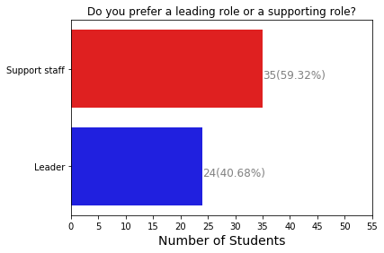

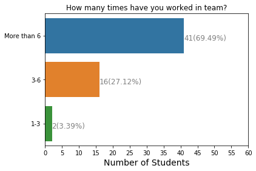

